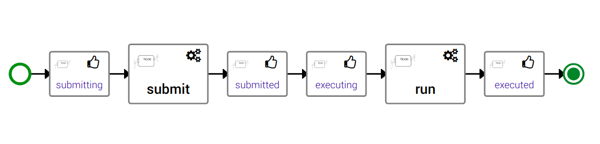

..
   Copyright 2018 Bull S.A.S. Atos Technologies - Bull, Rue Jean Jaures, B.P.68, 78340, Les Clayes-sous-Bois, France.

   Licensed under the Apache License, Version 2.0 (the "License");
   you may not use this file except in compliance with the License.
   You may obtain a copy of the License at

       http://www.apache.org/licenses/LICENSE-2.0

   Unless required by applicable law or agreed to in writing, software
   distributed under the License is distributed on an "AS IS" BASIS,
   WITHOUT WARRANTIES OR CONDITIONS OF ANY KIND, either express or implied.
   See the License for the specific language governing permissions and
   limitations under the License.
   ---

Working with Jobs
=================

What's a Job?
-------------

By opposite to a service which is a long running application, a Job is an
application that runs to completion.

TOSCA life-cycle (install -> configure -> start ....... then finally stop
-> delete) was designed to handle services.
There is no concept of Jobs life-cycle within normative TOSCA.

But, as per our experience in HPC and emerging container scheduling
within Container as a Service solutions like Kubernetes, we are convinced
that supporting Job scheduling is fundamental for any orchestration solution.

So we decided in collaboration with the Alien4Cloud team to extend TOSCA to
support Jobs!

Extending TOSCA to support Jobs
-------------------------------

First was the life-cycle! In TOSCA the core concept is the life-cycle. So,
based on our experience we defined a life-cycle for Jobs.

Translated in TOSCA, we defined a new interface
``tosca.interfaces.node.lifecycle.Runnable`` this interface defines three
operations:

* ``submit``: Submit is this operation that *submits* a job to a Job Scheduler,
  generally at the end of the ``submit`` we got a **job identifier**
* ``run``: Run is an asynchronous operation that will be called periodically
  to check the **job status**.
* ``cancel``: Cancel allows to *cancels* a **submitted job**.

Supported Jobs Schedulers
-------------------------

Slurm
~~~~~

Slurm is an HPC scheduler. Unsurprisingly, it was our first builtin support for
Jobs scheduling. Our Slurm support allows run single jobs and batches made of
several jobs.

.. todo:: Include a description on how to write SlurmBin/SlurmBatch/Singularity
          Jobs

Kubernetes
~~~~~~~~~~

Over the years Kubernetes became the de-facto standard of Containers As A
Service (CaaS).

Kubernetes has a special builtin *Controller* for jobs called *Jobs - Run to
Completion*.

.. todo:: Include a description on how to write Kubernetes Jobs

The one you want!
~~~~~~~~~~~~~~~~~

Yorc also support Jobs defined in pure-TOSCA. That means that you are able
to write using YAML and Python, Shell or Ansible scripts your own interaction
with any scheduler.

All you need to do is to provide implementation for at least the ``submit``
operation of the job life-cycle. If you do not provide implementation for
the ``run`` operation, your job will run in *fire and forget* mode, you will
not be able to get information about its completion. Similarly, if you do not
provide an implementation for the ``cancel`` operation then your Job will
simply not being cancellable.

To allow Yorc to manage your job properly some conventions:

* at the end of the ``submit`` operation you should export a fact or
  environment variable named ``TOSCA_JOB_ID`` containing the
  **submitted job identifier**.

* Yorc automatically injects this ``TOSCA_JOB_ID`` as an input of the ``run``
  and ``cancel`` operations.

* The ``run`` operation should be designed to be **non-blocking** and
  **called several times**. Its primary role is to check the job status. It
  should  export a fact or environment variable named ``TOSCA_JOB_STATUS``
  containing one of the following values:

  * ``COMPLETED``: meaning that the job is done successfully.
  * ``FAILED``: meaning that the job is done but in error.
  * ``RUNNING``: meaning that the job is still running.
  * ``QUEUED``: meaning that the job is submitted but didn't started yet.

  Internally ``RUNNING`` and ``QUEUED`` statuses are handled the same way by
  Yorc that will recall the ``run`` operation after a delay to refresh the
  status.

* The ``run`` operation can also be used to retrieve logs or perform some
  cleanup after the job completion.

You can find an example of a pure-TOSCA implementation of jobs in the official
*CSARs public library* with an implementation of a
`Spark Job <https://github.com/alien4cloud/csar-public-library/tree/develop/org/alien4cloud/spark/job-linux-sh>`_

Specific workflows for Jobs
---------------------------

When your application contains Jobs (meaning node templates which implements
the ``tosca.interfaces.node.lifecycle.Runnable`` interface) then Alien4Cloud
will automatically generate two workflows:

* ``run``: a workflow that submits and monitor jobs
* ``cancel``: a workflow that cancels jobs

.. warning:: The cancel workflow is a kind of temporary work around. It allows
   to cancel jobs but do not take care if the job is submitted or not. The
   recommended way to cancel a ``run`` workflow is to cancel the associated
   task in Yorc using either the CLI or the Rest API.
   This is temporary and we will provide soon a way to cancel workflows directly
   from Alien4Cloud.

The ``run`` workflow allows to orchestrate Jobs. That means that if for
instance, ``jobB`` depends on ``jobA`` using a TOSCA ``dependsOn`` or
``connectsTO`` relationship then Alien4Cloud will generate a workflow that
first submit and wait for the completion of ``jobA`` before submitting
``jobB``.

Jobs cancellation
-----------------

The proper way to cancel Jobs that were submitted by a TOSCA workflow is
to cancel the associated Yorc Task/Execution of this workflow.
This way Yorc will automatically call ``cancel`` operations for nodes that
implement it and which have successfully executed their ``submit`` operation.
Currently those automatic cancellation steps do not appear in Alien4Cloud.
We will work soon on making them visible.
