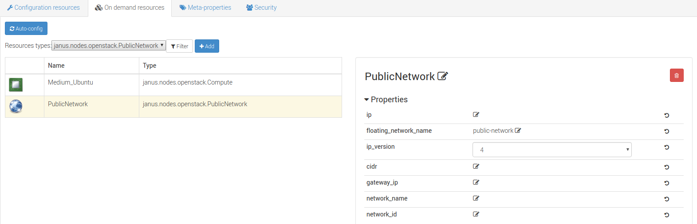
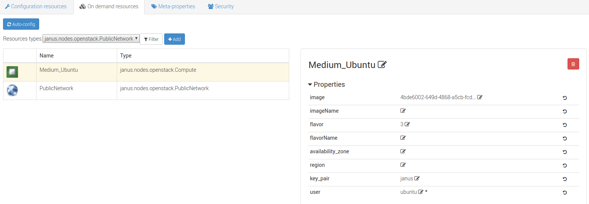

..
   Copyright 2018 Bull S.A.S. Atos Technologies - Bull, Rue Jean Jaures, B.P.68, 78340, Les Clayes-sous-Bois, France.

   Licensed under the Apache License, Version 2.0 (the "License");
   you may not use this file except in compliance with the License.
   You may obtain a copy of the License at

       http://www.apache.org/licenses/LICENSE-2.0

   Unless required by applicable law or agreed to in writing, software
   distributed under the License is distributed on an "AS IS" BASIS,
   WITHOUT WARRANTIES OR CONDITIONS OF ANY KIND, either express or implied.
   See the License for the specific language governing permissions and
   limitations under the License.
   ---

Configure a Yorc Orchestrator and Locations
===========================================

Now we must define an orchestrator and one or more locations (where we will actually deploy applications).
In Alien4Cloud every location is managed by an orchestrator.

The Alien4Cloud Yorc Plugin installed in the previous section allows to create the Yorc orchestrator and locations.

Several location types are available ; they correspond to the infrastructure types supported by Yorc (OpenStack, AWS, Kubernetes, etc.).
In order to deploy applications and run them on a given infrastructure, Yorc must be properly configured for that
infrastructure (see "Infrastructure configuration" chapter in Yorc documentation).

Configure a Yorc Orchestrator
------------------------------

To create an orchestrator, go to |AdminBtn| and in the |OrchBtn| sub-menu. Create an orchestrator named ``Yorc`` with the plugin
``Yorc Orchestrator Factory : 3.0.0-SNAPSHOT``.

At this moment your orchestrator is created but not enabled. Click on your orchestrator to see the information page, and then
click on the configuration menu icon |OrchConfigBtn|.

In the Driver configuration part, add the URL of your Yorc server (should respect the format: ``http://yorc-ip:8800``) and return to the previous page to enable your orchestrator.

If Yorc is secured (ssl enabled):
  * the yorc URL should use the ``https`` protocol
  * the CA authority used to sign the Yorc certificates should be imported in the Java truststore ; otherwise, check ``insecureTL``

Configure an OpenStack Location
-------------------------------

Once your orchestrator is created and enabled, go to the locations page by clicking on |OrchLocBtn|. Create a location named ``openstack`` (or a name of your choice)
and select ``OpenStack`` on the infrastructure type drop-down. The details page of your location should appear. Go to |OrchLocODRBtn| and
add the following resources:

  * yorc.nodes.openstack.PublicNetwork
  * yorc.nodes.openstack.Compute

Click on the network and set ``floating_network_name`` to the name of your OpenStack public network for the tenant where the Yorc instance
is deployed.

Click on the compute and set the ``image`` to the id of your image in OpenStack (in order to use our samples in next sections, please use
an Ubuntu 14.04+ or Centos 7.2+ image), the ``flavor`` to ``3`` (medium for a default OpenStack config). Set ``key_pair`` to the OpenStack
keypair that correspond to the private key that you stored under ``~/.ssh/yorc.pem`` during your Yorc server setup. Finally, in the ``endpoint``
capability of the Compute, open the ``credentials`` complex type and set the ``user`` to a user available in your image (generally ``ubuntu``
for Ubuntu cloud images)

Configure a Kubernetes Location
-------------------------------
In order to deploy applications on a Kubernetes location, the Yorc orchestrator must be connected to a properly configured Yorc server
(see "Infrastructure configuration" chapter in Yorc documentation ; the Yorc server must be able to connect to the Kubernetes cluster's master).

Select ``Yorc`` orchestrator and go to the locations page by clicking on |OrchLocBtn|. Create a location named ``kubernetes`` (or a name of your choice)
and select ``Kubernetes`` on the infrastructure type drop-down. The details page of your location should appear.

Go to |OrchLocODRBtn| and search in the ``Catalog`` resources with type prefix ``org.alien4cloud.kubernetes.api.types`` (we'll use ``k8s_api`` for this prefix).
You have to add the following resources:

  * ``k8s_api.Deployment``
  * ``k8s_api.Container``
  * ``k8s_api.Service``
  * ``k8s_api.volume.*`` # the volume types needed by applications

Go to |OrchLocTMBtn| view to setup modifiers on your location:

  * add ``Kubernetes modifier`` at the phase ``post location match``
  * add ``Yorc modifier for kubernetes`` at the phase ``post-node-match``

.. |AdminBtn| image:: _static/img/administration-btn.png
              :alt: administration

.. |OrchBtn| image:: _static/img/orchestrator-menu-btn.png
             :alt: orchestrator

.. |OrchConfigBtn| image:: _static/img/orchestrator-config-btn.png
                   :alt: orchestrator configuration

.. |OrchLocBtn| image:: _static/img/orchestrator-location-btn.png
                :alt: orchestrator location

.. |OrchLocODRBtn| image:: _static/img/on-demand-ressource-tab.png
                   :alt: on-demand resources

.. |OrchLocTMBtn| image:: _static/img/topology-modifier-tab.png
                   :alt: topology modifier

