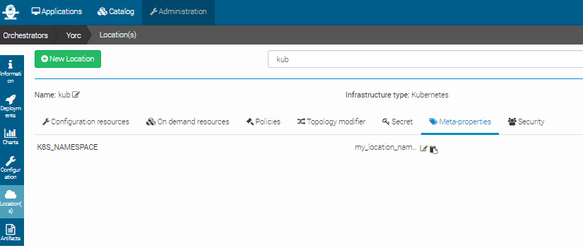

..
   Copyright 2018 Bull S.A.S. Atos Technologies - Bull, Rue Jean Jaures, B.P.68, 78340, Les Clayes-sous-Bois, France.

   Licensed under the Apache License, Version 2.0 (the "License");
   you may not use this file except in compliance with the License.
   You may obtain a copy of the License at

       http://www.apache.org/licenses/LICENSE-2.0

   Unless required by applicable law or agreed to in writing, software
   distributed under the License is distributed on an "AS IS" BASIS,
   WITHOUT WARRANTIES OR CONDITIONS OF ANY KIND, either express or implied.
   See the License for the specific language governing permissions and
   limitations under the License.
   ---

Configure a Yorc Orchestrator and a Location
============================================

Now we must define an orchestrator and one or more locations (where we will actually deploy applications).
In Alien4Cloud every location is managed by an orchestrator.

The Alien4Cloud Yorc Plugin installed in the previous section allows to create the Yorc orchestrator and locations.

Several location types are available ; they correspond to the infrastructure types supported by Yorc (OpenStack, AWS, Kubernetes, etc.).
In order to deploy applications and run them on a given infrastructure, Yorc must be properly configured for that
infrastructure (see "Infrastructure configuration" chapter in Yorc documentation).

Before creating the Yorc orchestrator, let's see how to define meta-properties that can be used to define some properties that are common to all the applications deployed in a location.

Define Meta-properties
----------------------

To define meta-properties, go to |AdminBtn| and in the |MetaBtn| sub-menu.

Then you can create a new meta-property by clicking on |MetPropNewBtn| and providing a name, a description and other information that characterize it.

In the image below, there are 2 meta-properties defined. They both have the K8S_NAMESPACE ``Name`` and string ``Type``. But they have different ``Target``s.
The ``location`` target specifies that the meta-property can be used to define a property for a location. In this particular case, it can be used to define a namespace for a Kubernetes location.
The ``application`` target specifies that the meta-property can be used to  specify a property having a value that applies to a particular application.
A default value can be defined for meta-properties, but its not mandatory.

.. image:: _static/img/meta-properties.png
   :alt: Meta-properties definition
   :align: center

Configure a Yorc Orchestrator
-----------------------------

To create an orchestrator, go to |AdminBtn| and in the |OrchBtn| sub-menu. Create an orchestrator named ``Yorc`` with the following named plugin:
  * Yorc Orchestrator Factory : |version|

At this moment your orchestrator is created but not enabled. Click on your orchestrator to see the information page, and then
click on the configuration menu icon |OrchConfigBtn|.

In the Driver configuration part, add the URL of your Yorc server (should respect the format: ``http://yorc-ip:8800``) and return to the previous page to enable your orchestrator.

If Yorc is secured (ssl enabled):
  * the yorc URL should use the ``https`` protocol
  * the CA authority used to sign the Yorc certificates should be imported in the Java truststore ; otherwise, check ``insecureTL``

Configure an OpenStack Location
-------------------------------

Once your orchestrator is created and enabled, go to the locations page by clicking on |OrchLocBtn|

Create a new location clicking on |OrchLocNewBtn| and provide a location name. Select ``OpenStack`` in the infrastructure type drop-down.

The details page of your location should appear.

Go to |OrchLocODRBtn| and add the following resources:

  * yorc.nodes.openstack.PublicNetwork
  * yorc.nodes.openstack.Compute

Click on the network and set ``floating_network_name`` to the name of your OpenStack public network for the tenant where the Yorc instance
is deployed.

.. image:: _static/img/orchestrator-loc-conf-net.png
   :alt: Network configuration
   :align: center

Click on the compute and set the ``image`` to the id of your image in OpenStack (in order to use our samples in next sections, please use
an Ubuntu 14.04+ or Centos 7.2+ image), the ``flavor`` to ``3`` (medium for a default OpenStack config).

Set ``key_pair`` to the OpenStack keypair that correspond to the private key that you stored under ``~/.ssh/yorc.pem`` during your Yorc server setup.

Finally, in the ``endpoint`` capability of the Compute, open the ``credentials`` complex type and set the ``user`` to a user available in your image (generally ``ubuntu``
for Ubuntu cloud images).
This user will be used to connect to this on-demand compute resource once created, and to deploy applications on it (while the user used to create this on-demand resource is defined in the Yorc server configuration).

.. image:: _static/img/orchestrator-loc-conf-compute.png
   :alt: Compute Node configuration
   :align: center

Configure a Slurm Location
--------------------------

Go to the locations page by clicking on |OrchLocBtn|

Create a new location clicking on |OrchLocNewBtn| and provide a location name. Select ``Slurm`` in the infrastructure type drop-down.

The details page of your location should appear.

Go to |OrchLocODRBtn| and add the following resource:

  * yorc.nodes.slurm.Compute

Click on the compute, the following details should appear and show the endpoint ``credentials`` must be edited:

.. image:: _static/img/slurm-compute.png
   :alt: Compute Node configuration
   :align: center

Edit ``credentials`` and specify a user that will be used to connect to this on-demand compute resource once created,
and to deploy applications on it (while the user used to create this on-demand resource is defined in the Yorc server configuration):

.. image:: _static/img/slurm-credentials.png
   :alt: Compute Node credentials
   :align: center

You could define here as well either a password, provided as a ``token`` parameter value (``token_type`` being set to ``password``),
or a private key by editing the ``keys`` parameter and adding a new key ``0`` with a value being the path to a private key, as below :

.. image:: _static/img/slurm-creds-key.png
   :alt: Compute Node credentials key
   :align: center

If no password or private key is defined, the orchestrator will attempt to use a key ``~/.ssh/yorc.pem`` that should have been defined during your Yorc server setup.

Configure a Hosts Pool Location
-------------------------------

Go to the locations page by clicking on |OrchLocBtn|

Create a new location clicking on |OrchLocNewBtn| and provide a location name. Select ``HostsPool`` in the infrastructure type drop-down.

The details page of your location should appear.

Go to |OrchLocODRBtn| and add the following resource:

  * yorc.nodes.hostspool.Compute

Click on the compute, the following details should appear:

.. image:: _static/img/hosts-pool-compute.png
   :alt: Compute Node configuration
   :align: center

You can select the property ``shareable`` if you want to make this compute node shareable, so that different deployments could use this same resource.

Credentials don't have to be defined here. For hosts in a Hosts Pool, credentials are defined in the Yorc server configuration.

Configure a Google Cloud Platform Location
------------------------------------------

Go to the locations page by clicking on |OrchLocBtn|

Create a new location clicking on |OrchLocNewBtn| and provide a location name. Select ``Google Cloud`` in the infrastructure type drop-down.

The details page of your location should appear.

Go to |OrchLocODRBtn| and add the following resource:

  * yorc.nodes.google.Compute
  * yorc.nodes.google.PersistentDisk

Click on the compute, the following details should appear, with here several properties set as explained below:

.. image:: _static/img/google-compute-on-demand.png
   :alt: Compute configuration
   :align: center

Specify which image to use to initialize the boot disk, defining properties ``image_project``, ``image_family``, ``image``.

At least one of the tuples ``image_project/image_family``, ``image_project/image``, ``family``, ``image``, should be defined:
  * ``image_project`` is the project against which all image and image family references will be resolved.
    If not specified, and either image or image_family is provided, the current default project is used.
  * ``image_family`` is the family of the image that the boot disk will be initialized with.
    When a family is specified instead of an image, the latest non-deprecated image associated with that family is used.
  * ``image`` is the image from which to initialize the boot disk.
    If not specified, and an image family is specified, the latest non-deprecated image associated with that family is used.

See available public images described at `Compute Engine Public Images <https://cloud.google.com/compute/docs/images#os-compute-support/>`_.
For example, to use the latest CentOS 7 version, use ``image_project`` `centos-cloud` and ``image_family`` `centos-7`.

Set the ``machine_type`` value according to your needs in CPU and memory (default `n1-standard-1`).
See `list of available machine types <https://cloud.google.com/compute/docs/machine-types/>`_.

Set the mandatory parameter ``zone`` to define the zone on which the Compute Instance should be hosted.
See `list of available regions and zones <https://cloud.google.com/compute/docs/regions-zones/>`_.

Edit ``credentials`` to provide a mandatory user name.
This user will be used to connect to this on-demand compute resource once created, and to deploy applications on it.

.. image:: _static/img/google-credentials.png
   :alt: Compute Instance credentials
   :align: center

You could define here as well a private key by editing the ``keys`` parameter and adding a new key ``0`` with a value being the path to a private key, as below :

.. image:: _static/img/google-creds-key.png
   :alt: Compute Instance credentials key
   :align: center

If no private key is defined, the orchestrator will attempt to use a key ``~/.ssh/yorc.pem`` that should have been defined during your Yorc server setup.

The user you specify here must be defined, along with its associated public SSH key, either at your Google Project level, or at this Compute Instance level.
See Google documentation for :

  * `Project-wide public ssh keys <https://cloud.google.com/compute/docs/instances/adding-removing-ssh-keys#project-wide/>`_
  * `Instance-level public SSH keys <https://cloud.google.com/compute/docs/instances/adding-removing-ssh-keys#instance-only/>`_

For example, assuming you have a private ssh key ``./id_rsa`` and a public ssh key ``./id_rsa.pub``,
you can first create a file containing a user name and the public key content::

    echo  "user1:`cat id_rsa.pub`" > userkeys.txt

Then  define this user and public key at the project level, using Google Cloud CLI::

    gcloud compute project-info add-metadata --metadata-from-file ssh-keys=userkeys.txt

Then, by default, all compute instances will inherit from this user/public key definition,
the user will be created on the compute instance and you will be able to ssh on your compute instance running::

    ssh -i ./id_rsa user1@<your instance external ip address>

For details on other optional Compute Instance properties, see `Compute Instance creation <https://cloud.google.com/sdk/gcloud/reference/compute/instances/create>`_.

Click on the ``PersistentDisk``, the following details should appear, with here several properties set as explained below:

.. image:: _static/img/google-disk-on-demand.png
   :alt: PersistentDisk configuration
   :align: center

Set the mandatory parameter ``zone`` to define the zone on which the disk resides.
In any case the disk must be on the same zone as the associated Compute instances.
See `list of available regions and zones <https://cloud.google.com/compute/docs/regions-zones/>`_.

Set the mandatory parameter ``size`` to define the required size for persistent disks.

If you want the disk to be deleted when the application referencing this disk is undeployed,
check the parameter ``deletable``. By default, the disk is not deleted.

If you want to refer to an existing disk, set the mandatory parameter ``volume_id`` with its Google Reference Name. This parameter allows comma-separated values of disk names.

If you want to attach the disk to a compute with a ``READ_ONLY`` mode, you need to set this property to the ``yorc.relationships.google.AttachesTo`` relationship between the disk and the compute.

For details on other optional PersistentDisk properties, see `Persistent Disk Creation <https://cloud.google.com/sdk/gcloud/reference/compute/disks/create>`_.

Configure an AWS Location
-------------------------

Go to the locations page by clicking on |OrchLocBtn|

Create a new location clicking on |OrchLocNewBtn| and provide a location name. Select ``AWS`` in the infrastructure type drop-down.

The details page of your location should appear.

Go to |OrchLocODRBtn| and add the following resources:

  * yorc.nodes.aws.PublicNetwork
  * yorc.nodes.aws.Compute

Click on the compute, the following details should appear:

.. image:: _static/img/aws-compute-on-demand.png
   :alt: Compute configuration
   :align: center

Edit mandatory parameters AWS ``image_id``, ``instance_type``, ``security_groups`` and ``key_name`` to provide the name of a key pair already known from AWS.

Edit ``credentials`` to provide a user name.
This user will be used to connect to this on-demand compute resource once created, and to deploy applications on it (while user credentials used to create this on-demand resource are defined in the Yorc server configuration).

Configure a Kubernetes Location
-------------------------------
In order to deploy applications to a Kubernetes location, the Yorc orchestrator must be connected to a properly configured Yorc server
(see "Infrastructure configuration" chapter in Yorc documentation ; the Yorc server must be able to connect to the Kubernetes cluster's master).

Select ``Yorc`` orchestrator and go to the locations page by clicking on |OrchLocBtn|. Create a location named ``kubernetes`` (or a name of your choice)
and select ``Kubernetes`` on the infrastructure type drop-down. The details page of your location should appear.

Go to |OrchLocODRBtn| and search in the ``Catalog`` resources with type prefix ``org.alien4cloud.kubernetes.api.types`` (we'll use ``k8s_api`` for this prefix).
You have to add the following resources:

  * ``k8s_api.Deployment``
  * ``k8s_api.Container``
  * ``k8s_api.Service``
  * ``k8s_api.volume.*`` # the volume types needed by applications

Go to |OrchLocTMBtn| view to setup modifiers on your location:

  * add ``Kubernetes modifier`` at the phase ``post location match``
  * add ``Yorc modifier for kubernetes`` at the phase ``post-node-match``

If you defined a K8S_NAMESPACE meta-property with ``location`` target, you can use its value
to specify the namespace in which the Kubernetes resources will be created when deploying applications to this location.

In the image below, the user specifies that Kubernetes objects will belong to the namespace ``my_location_namespace``.

Note that the user can choose to use a particular namespace for each application. In this case, the K8S_NAMESPACE meta-property with ``application`` target must be used
like in the image below:

If both  K8S_NAMESPACE meta-property with ``location`` target and K8S_NAMESPACE meta-property with ``application`` target have values set, then the one with ``location`` target
has higher priority, so its value will be used to specify the Kubernets namespaces.

In any case, the specified namespace must exist in the Kubernetes infrastructure.

To simplify the deployment of application in test and development phase, we allow users not to define a specific namespace for its applications.
In this case there is no need to define a K8S_NAMESPACE meta-property, and the Kuberneters objects will be created in a namespace specially created for each application.
The namespace is deleted after the application is undeployed. The name of the created namespaces is constructed using the application name + the application's environment name.

.. |AdminBtn| image:: _static/img/administration-btn.png
              :alt: administration

.. |OrchBtn| image:: _static/img/orchestrator-menu-btn.png
             :alt: orchestrator

.. |MetaBtn| image:: _static/img/meta-menu-btn.png
             :alt: orchestrator

.. |OrchConfigBtn| image:: _static/img/orchestrator-config-btn.png
                   :alt: orchestrator configuration

.. |OrchLocBtn| image:: _static/img/orchestrator-location-btn.png
                :alt: orchestrator location

.. |OrchLocODRBtn| image:: _static/img/on-demand-ressource-tab.png
                   :alt: on-demand resources

.. |OrchLocTMBtn| image:: _static/img/topology-modifier-tab.png
                  :alt: topology modifier

.. |OrchLocNewBtn| image:: _static/img/new-location.png
                   :alt: new location

