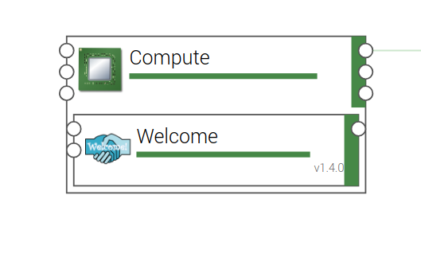

..
   Copyright 2018 Bull S.A.S. Atos Technologies - Bull, Rue Jean Jaures, B.P.68, 78340, Les Clayes-sous-Bois, France.

   Licensed under the Apache License, Version 2.0 (the "License");
   you may not use this file except in compliance with the License.
   You may obtain a copy of the License at

       http://www.apache.org/licenses/LICENSE-2.0

   Unless required by applicable law or agreed to in writing, software
   distributed under the License is distributed on an "AS IS" BASIS,
   WITHOUT WARRANTIES OR CONDITIONS OF ANY KIND, either express or implied.
   See the License for the specific language governing permissions and
   limitations under the License.
   ---

Applying policies
=================

Applying a Server Group Anti-affinity placement policy on OpenStack
-------------------------------------------------------------------

Let's imagine the use case of a resilient application on OpenStack:

This application is scalable but to enhance HA, you want each app instance located in a different
physical machine. So, if a breakdown occurs on one specific host, it doesn't touch all app instances but only one.

This can be done by applying ``yorc.openstack.policies.ServerGroupAntiAffinity`` on OpenStack.

Let's do it !

After configuring your OpenStack location as described :ref:`here <location_config_openstack_section>`, click on the |OrchLocPolicies| button, select ``catalog`` and use the search to find the ServerGroupAntiAffinity as below.

.. image:: _static/img/search-servergroup-policy.png
   :alt: Search serverGroup policy
   :align: center

Next, drag-and-drop the policy in the new policies resources list of your OpenStack location.
Rename the resource, for example ``ServerGroupAntiAffinity``.
Set the ``level`` property to ``host`` as it's a policy placement of ``host`` type by opposition to ``zone`` or ``region`` placement.

You can set the strict property to false (by default, this is set to true) if you accept that your deployment will be successful even if some instances are co-located.
Take care this is only possible if your OpenStack environment support Compute service API 2.15 or above.

You must finally have this configuration:

.. image:: _static/img/servergroup-policy-resource.png
   :alt: Configure your serverGroup policy
   :align: center

Now, your OpenStack location is configured with a Server Group anti-affinity placement policy.
You can apply it on your topology application by using abstract and so non infrastructure-dependent nodes and policies that let you deploy your application as well on OpenStack or on GCP if another specific placement policy is implemented for GCP too.

Select your application and go to the ``Topology Editor``. Click on the |TopologyEditorPolicies| button on the vertical blue bar on the left.
Click on the ``+ Add policies`` button, search the abstract policy node ``AntiAffinity`` (org.alien4cloud.policies.AntiAffinity) from alien-base-types and drag-and-drop it on the policies list of your topology.

Set the ``level`` property to ``host``.

Then you can select the ``Targets`` of the placement policy, i.e in this case, the node name of the compute instances you want not to be located on the same host.

Valid targets for applying ``ServerGroupAntiAffinity`` are:

  * One scalable compute node template with at least two as max instances number.
  * At least two different compute node templates, not necessarily scalable.

.. image:: _static/img/placement-topology-editor.png
   :alt: Add abstract anti-affinity policy to your topology application
   :align: center

That's it ! You just have to check the correct policy matching after choosing the Openstack location as the ``ServerGroupAntiAffinity`` derives from ``org.alien4cloud.policies.Affinity``

Deploy the application and enjoy !

.. image:: _static/img/policy-matching.png
   :alt: Policy matching before deploying application
   :align: center

.. |OrchLocPolicies| image:: _static/img/policies-button.png
                   :alt: policies button

.. |TopologyEditorPolicies| image:: _static/img/topology-policies-button.png
                  :alt: policies button

Applying HTTP Monitoring policy on a web application
----------------------------------------------------

This chapter presents how to apply an HTTP Monitoring policy on a web application in order to be informed when the web server
is down.

This can be done with ``yorc.policies.monitoring.HTTPMonitoring`` on any location.

A valid target type for applying ``yorc.policies.monitoring.HTTPMonitoring`` is ``tosca.nodes.SoftwareComponent`` .

Only one monitoring policy can be applied on a node template instance.

Let's deploy the ``Welcome Application`` as seen before :ref:`here <welcome_app_section>` and let's configure our HTTP monitoring policy.

Select your application and go to the ``Topology Editor``.

Click on the |TopologyEditorPolicies| button on the vertical blue bar on the left.

Click on the ``+ Add policies`` button, search the policy node ``httpMonitoring`` (yorc.policies.monitoring.HTTPMonitoring) from yorc-types and drag-and-drop it on the policies list of your topology.

Next, you just need to add the ``Welcome`` node template as target of the policy and set the policy properties as below:

The ``scheme`` property allows to select http or https protocol.

The ``port`` property allows to set the port of your web application you want to monitor.

The ``path`` and ``http_headers`` properties allows to specify an URL path and HTTP headers to use for sending request to the web application.

The ``time_interval`` property let you define how often the application must be checked.

Once the application is deployed, you can stop the ``Welcome ``WebServer by running the ``StopWebServer`` custom workflow and in function of the time_interval you specified,
you can rapidly (or not...) observe the Welcome node in Error State in the runtime view and the following log:

      ``[2019-04-09 15:15:31] [] [Welcome] Monitoring Check returned a failure for node (Welcome-0)``

Next, by running the ``startWebServer`` custom workflow, you restart the webserver and can observe the ``Welcome`` node is backed to normal:

     ``[2019-04-10 11:12:24] [] [Welcome] Monitoring Check is back to normal for node (Welcome-0) ``

The next step will be to fix this by a self-healing policy !
