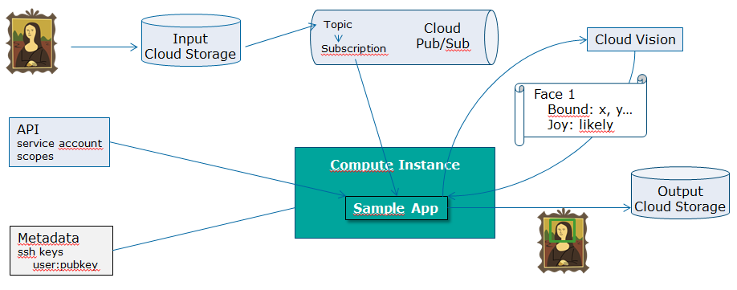
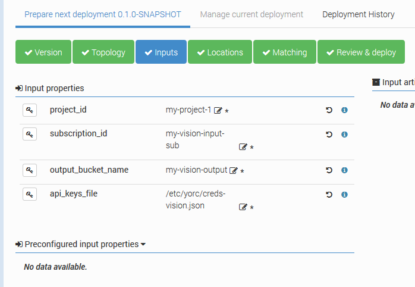

# Vision sample

This sample provides TOSCA types and topology allowing to deploy an application detecting faces and text in an image.
The deployment of this application was validated against a Google Cloud location on a on-demand compute instance using the image project/image family centos-cloud/centos-7.
  
The application is using several Google Cloud APIs:
  * [Cloud Pub/Sub](https://cloud.google.com/pubsub/) to be notified of new images uploade in Cloud Storage
  * [Cloud Vision](https://cloud.google.com/vision/) to detect faces and text in an image
  * [Cloud Storage](https://cloud.google.com/storage/) to download images from an input bucket and upload transformed images to an output bucket

so that when an image is added by the user in a input cloud storage bucket, the application is notified of the upload.
The application will then call the Cloud Vision API to request the detection of :
  * faces
  * likelihood of expressions on these faces
  * text
  * links to similar images on the Web
  * labels

Once the response is provided, the application will create a copy of the image and will update it to surround faces and text according to the coordinates returned by the Vision API.
A result page will be created, stored in an output cloud storage bucket and made publicly available.

The following picture describes the flow :



For a detailed description on how to start and configure Alien4Cloud/Ystia orchestrator,
and then deploy this application, see this blog post: 
[Deploying the image detection application on GoogleCloud](https://ystia.github.io/2018/08/14/gcp-sample-app.html).

## Prerequisites

An input and output storage buckets must be created, for example running:
```
gsutil mb gs://my-vision-input
gsutil mb gs://my-vision-output
```

A Cloud pub/sub topic and subscription must be created, for example running:
```
gsutil notification create -f json -t my-vision-topic gs://my-vision-input
gcloud beta pubsub subscriptions create my-vision-input-sub --topic=my-vision-topic
```

Once this is done, you are ready to deploy the Application.

##Load types and topology in Alien4Cloud

From the current directory, create zip files for types and topology:
```
cd linux/ansible
zip -r ../../vision_types.zip *
cd ../../topologies
zip -r ../vision_topo.zip *
```
Then upload these files in Alien4Cloud from `Catalog` > `Manage Archives`.

Once done, create an application from template VisionTopoloy that was just uploaded, and define input properties to provide :
  * the Google cloud project where the input storage bucket was created
  * the ID of the subscription you created to be notified on uploads in the input bucket
  * the name of the output bucket where to store results
  * a path to the API keys file accessible fron the Ystia Orchestrator, that will be used by the application to authenticate against services.

The API keys files should be created/downloaded from the Google Cloud Console
at 
(While doing this, don't forget to provide access to services describe above, like Cloud Vision).



## Deploy the application

Once the application is deployed, upload an image containing faces or text in your input storage/bucket, and 30 seconds/1 minute later, you should see in your output storage bucket a new subdirectory containing an html result page, with an associated public link on which you can click to see the detection results.
 